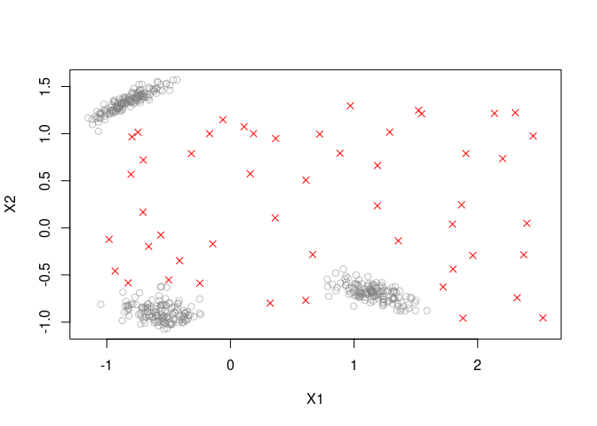

#  R package stream - Infrastructure for Data Stream Mining

[](https://CRAN.R-project.org/package=stream)
[](https://mhahsler.r-universe.dev/ui#package:stream)
[](https://CRAN.R-project.org/package=stream)

The package provides support for modeling and simulating data streams as
well as an extensible framework for implementing, interfacing and
experimenting with algorithms for various data stream mining tasks. The
main advantage of stream is that it seamlessly integrates with the large
existing infrastructure provided by R. The package provides:

-   **Stream Sources:** streaming from files, databases, in-memory data,
    URLs, pipes, socket connections and several data stream generators
    including dynamically streams with concept drift.
-   **Stream Processing** with filters (convolution, scaling,
    exponential moving average, …)
-   **Stream Aggregation:** sampling, windowing.
-   **Stream Clustering:** **BICO**, **BIRCH**, **D-Stream**,
    **DBSTREAM**, and **evoStream**.
-   **Stream Outlier Detection** based on **D-Stream**, **DBSTREAM**.
-   **Stream Classification** with **DecisionStumps**,
    **HoeffdingTree**, **NaiveBayes** and **Ensembles** (streamMOA via
    RMOA).
-   **Stream Regression** with **Perceptron**, **FIMTDD**, **ORTO**, …
    (streamMOA via RMOA).
-   **Stream Mining Evaluation** with prequential error estimation.

Additional packages in the stream family are:

-   [streamMOA](https://github.com/mhahsler/streamMOA): Interface to
    clustering algorithms implemented in the
    [MOA](https://moa.cms.waikato.ac.nz/) framework. The package
    interfaces clustering algorithms like of **DenStream**,
    **ClusTree**, **CluStream** and **MCOD**. The package also provides
    an interface to [RMOA](https://github.com/jwijffels/RMOA) for MOA’s
    stream classifiers and stream regression models.
-   [rEMM](https://github.com/mhahsler/rEMM): Provides implementations
    of **threshold nearest neighbor clustering** (tNN) and **Extensible
    Markov Model** (EMM) for modelling temporal relationships between
    clusters.

## Installation

**Stable CRAN version:** Install from within R with

``` r
install.packages("stream")
```

**Current development version:** Install from
[r-universe.](https://mhahsler.r-universe.dev/ui#package:stream)

``` r
install.packages("stream", repos = "https://mhahsler.r-universe.dev")
```

## Usage

Load the package and a random data stream with 3 Gaussian clusters and
10% noise and scale the data to z-scores.

``` r
library("stream")
set.seed(2000)

stream <- DSD_Gaussians(k = 3, d = 2, noise = 0.1) %>%
    DSF_Scale()
get_points(stream, n = 5)
```

    ##       X1     X2 .class
    ## 1 -0.267 -0.802      2
    ## 2  0.531  1.078     NA
    ## 3 -0.706  1.427      3
    ## 4 -0.781  1.355      3
    ## 5  1.170 -0.712      1

``` r
plot(stream)
```

<!-- -->

Cluster a stream of 1000 points using D-Stream which estimates point
density in grid cells.

``` r
dsc <- DSC_DStream(gridsize = 0.1)
update(dsc, stream, 1000)
plot(dsc, stream, grid = TRUE)
```

<!-- -->

``` r
evaluate_static(dsc, stream, n = 100)
```

    ## Evaluation results for micro-clusters.
    ## Points were assigned to micro-clusters.
    ## 
    ##             numPoints      numMicroClusters      numMacroClusters 
    ##              100.0000               65.0000                3.0000 
    ##        noisePredicted                   SSQ            silhouette 
    ##               23.0000                0.1696                0.0786 
    ##       average.between        average.within          max.diameter 
    ##                1.7809                0.5816                3.9368 
    ##        min.separation ave.within.cluster.ss                    g2 
    ##                0.0146                0.5217                0.1596 
    ##          pearsongamma                  dunn                 dunn2 
    ##                0.0637                0.0037                0.0154 
    ##               entropy              wb.ratio            numClasses 
    ##                3.1721                0.3266                4.0000 
    ##           noiseActual        noisePrecision        outlierJaccard 
    ##               16.0000                0.6957                0.6957 
    ##             precision                recall                    F1 
    ##                0.6170                0.1618                0.2563 
    ##                purity             Euclidean             Manhattan 
    ##                0.9920                0.1633                0.3000 
    ##                  Rand                 cRand                   NMI 
    ##                0.7620                0.1688                0.5551 
    ##                    KP                 angle                  diag 
    ##                0.2651                0.3000                0.3000 
    ##                    FM               Jaccard                    PS 
    ##                0.3159                0.1470                0.0541 
    ##                    vi 
    ##                2.2264 
    ## attr(,"type")
    ## [1] "micro"
    ## attr(,"assign")
    ## [1] "micro"

Outlier detection using DBSTREAM which uses micro-clusters with a given
radius.

``` r
dso <- DSOutlier_DBSTREAM(r = 0.1)
update(dso, stream, 1000)
plot(dso, stream)
```

<!-- -->

``` r
evaluate_static(dso, stream, n = 100, measure = c("numPoints", "noiseActual", "noisePredicted",
    "noisePrecision"))
```

    ## Evaluation results for micro-clusters.
    ## Points were assigned to micro-clusters.
    ## 
    ##      numPoints    noiseActual noisePredicted noisePrecision 
    ##            100              7              7              1 
    ## attr(,"type")
    ## [1] "micro"
    ## attr(,"assign")
    ## [1] "micro"

Preparing complete stream process pipelines that can be run using a
single `update()` call.

``` r
pipeline <- DSD_Gaussians(k = 3, d = 2, noise = 0.1) %>%
    DSF_Scale() %>%
    DST_Runner(DSC_DStream(gridsize = 0.1))
pipeline
```

    ## DST pipline runner
    ## DSD: Gaussian Mixture (d = 2, k = 3)
    ## + scaled
    ## DST: D-Stream 
    ## Class: DST_Runner, DST

``` r
update(pipeline, n = 500)
pipeline$dst
```

    ## D-Stream 
    ## Class: DSC_DStream, DSC_Micro, DSC_R, DSC 
    ## Number of micro-clusters: 160 
    ## Number of macro-clusters: 13

## Acknowledgements

The development of the stream package was supported in part by NSF
IIS-0948893, NSF CMMI 1728612, and NIH R21HG005912.

## References

-   Michael Hahsler, Matthew Bolaños, and John Forrest. [stream: An
    extensible framework for data stream clustering research with
    R.](https://dx.doi.org/10.18637/jss.v076.i14) *Journal of
    Statistical Software,* 76(14), February 2017.
-   [stream package
    vignette](https://cran.r-project.org/package=stream/vignettes/stream.pdf)
    with complete examples.
-   [stream reference
    manual](https://cran.r-project.org/package=stream/stream.pdf)
