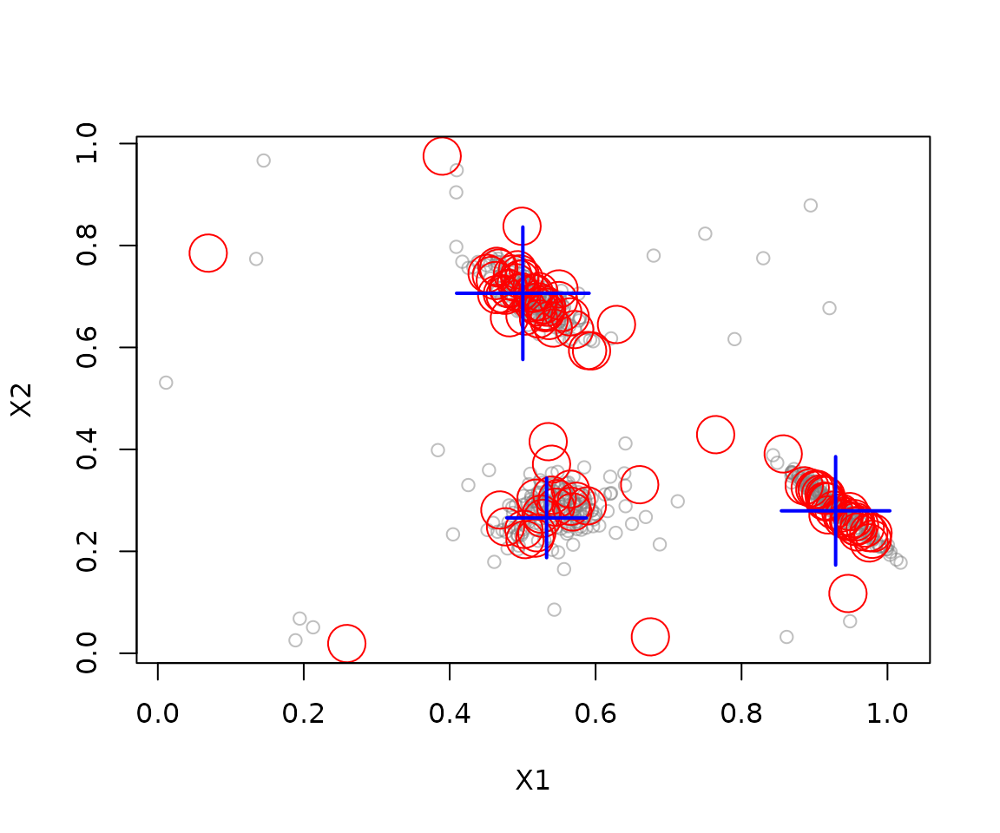

# Getting started with stream

The `stream` package provides tools to generate or read data streams,
update stream mining models, and inspect their results. This guide walks
through a small clustering workflow: create a stream, inspect incoming
points, build a clustering model, and evaluate it on new points.

## Installation

Install the released package from CRAN, then load it in your R session:

``` r

install.packages("stream")
```

``` r

library(stream)
```

## Create and inspect a data stream

[`DSD_Gaussians()`](http://michael.hahsler.net/stream/reference/DSD_Gaussians.md)
generates a stream with three clusters and a small amount of noise. A
stream can be unbounded, so request a finite number of points with
[`get_points()`](http://michael.hahsler.net/stream/reference/get_points.md):

``` r

stream <- DSD_Gaussians(k = 3, d = 2, noise = 0.05)
points <- get_points(stream, n = 5)
points
#>          X1        X2 .class
#> 1 0.5458535 0.6891478      1
#> 2 0.5751342 0.3031995      2
#> 3 0.5070179 0.2583102      2
#> 4 0.5436979 0.3234242      2
#> 5 0.6294917 0.2378384      2
```

The returned data frame contains feature columns and information columns
such as `.class`, which records the generating cluster. Use
`info = FALSE` when you only need feature values. Plot a sample of the
stream to see its structure:

``` r

plot(stream, n = 500)
```


## Update a clustering model

[`DSC_TwoStage()`](http://michael.hahsler.net/stream/reference/DSC_TwoStage.md)
combines an online micro-clusterer with an offline macro-clusterer.
Here, a sliding window stores recent points and k-means groups the
window’s micro-clusters into three macro-clusters.
[`update()`](http://michael.hahsler.net/stream/reference/update.md)
feeds 500 points from the stream into the model:

``` r

clustering <- DSC_TwoStage(
  micro = DSC_Window(horizon = 100),
  macro = DSC_Kmeans(k = 3)
)

update(clustering, stream, n = 500)
clustering
#> Sliding window + k-Means (weighted) 
#> Class: DSC_TwoStage, DSC_Macro, DSC 
#> Number of micro-clusters: 100 
#> Number of macro-clusters: 3
```

Inspect the number of clusters and their centers, then plot the result:

``` r

nclusters(clustering, type = "micro")
#> [1] 100
nclusters(clustering, type = "macro")
#> [1] 3
get_centers(clustering, type = "macro")
#>          X1        X2
#> 1 0.9289433 0.2794326
#> 2 0.5328247 0.2655636
#> 3 0.5002698 0.7062714
plot(clustering, stream, type = "both")
```



## Evaluate on new points

[`evaluate_static()`](http://michael.hahsler.net/stream/reference/evaluate.md)
tests the current model on new points without updating it. The generated
stream includes true cluster labels, so external measures such as purity
and the adjusted Rand index can be calculated:

``` r

evaluate_static(
  clustering,
  stream,
  measure = c("purity", "crand"),
  n = 200,
  type = "macro",
  assign = "macro"
)
#> Evaluation results for macro-clusters.
#> Points were assigned to macro-clusters.
#> 
#>    purity     cRand 
#> 0.9698455 0.9565454 
#> attr(,"type")
#> [1] "macro"
#> attr(,"assign")
#> [1] "macro"
```

## Further reading

See the [function
reference](http://michael.hahsler.net/stream/reference/index.md) and the
package vignettes for details on data generators, stream filters,
clustering methods, evaluation, and extending `stream` with new
components.
